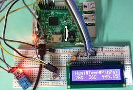

### Introduction:

The **Raspberry Pi** is a versatile and affordable single-board computer that can be used for various projects. In this tutorial, I will guide you through the process of building your very own Raspberry Pi weather station. By the end of this tutorial, you will have a fully functional weather station that can measure temperature, humidity, and atmospheric pressure. So, let's get started!!

**Step 1**: Gather the necessary components
Before diving into the project, make sure you have all the required components. Here's a list of what you'll need:

1.Raspberry Pi (any model with GPIO pins)
2.DHT11 temperature and humidity sensor
3.BMP180 barometric pressure sensor
4.Breadboard and jumper wires
5.MicroSD card with Raspbian installed
6.Power supply for the Raspberry Pi
7.Computer with an SD card reader


For more information related these components [click here](https://youtu.be/gPJs9Qqexc)

**Step 2**: Set up the Raspberry Pi
First, we need to set up the Raspberry Pi. Follow these steps:

1.Insert the microSD card with Raspbian into the Raspberry Pi.
2.Connect the HDMI cable from the Raspberry Pi to a monitor or TV.
3.Plug in the keyboard and mouse to the USB ports.
4.Connect the power supply to the Raspberry Pi to turn it on.
4.Follow the on-screen instructions to complete the initial setup of Raspbian.

**Step 3**: Connect the sensors
Now, let's connect the sensors to the Raspberry Pi using the breadboard and jumper wires:

Place the DHT11 sensor on the breadboard and connect its VCC pin to the 3.3V pin on the Raspberry Pi.
Connect the DHT11 sensor's GND pin to any of the GND pins on the Raspberry Pi.
Connect the DHT11 sensor's DATA pin to GPIO pin 4 on the Raspberry Pi.
Next, connect the BMP180 sensor to the breadboard and connect its VCC pin to the 3.3V pin on the Raspberry Pi.
Connect the BMP180 sensor's GND pin to any of the GND pins on the Raspberry Pi.
Connect the BMP180 sensor's SDA pin to GPIO pin 2 (SDA) on the Raspberry Pi.
Connect the BMP180 sensor's SCL pin to GPIO pin 3 (SCL) on the Raspberry Pi.

**Following is the picture of how the setup will look**:-



**Step 4**: Install necessary libraries
To interact with the sensors, we need to install some libraries. Open the Terminal on the Raspberry Pi and run the following commands:


Update the package lists: sudo apt-get update
Install the required libraries: sudo apt-get install python3-dev python3-pip
Install the Adafruit DHT library: sudo pip3 install Adafruit_DHT
Install the BMP library: sudo pip3 install adafruit-circuitpython-bmp

**Step 5**: Write the code
Create a new **Python script** on the Raspberry Pi using your preferred text editor. 

Here's a sample Python program that reads data from the sensor and displays it on the console:
---
```python
import Adafruit_DHT
import time

# Set up the sensor model and GPIO pin
sensor = Adafruit_DHT.DHT22
pin = 4
while True:
    # Read the temperature and humidity from the sensor
    humidity, temperature = Adafruit_DHT.read_retry(sensor, pin)

    # Check if the sensor reading was successful
    if humidity is not None and temperature is not None:
        print('Temperature: {0:0.1f}°C'.format(temperature))
        print('Humidity: {0:0.1f}%'.format(humidity))
    else:
        print('Failed to retrieve sensor data.')

    # Wait for some time before taking the next reading
    time.sleep(2)
```
---
**To run the program, follow these steps :**

Set up your Raspberry Pi with Raspbian or any other compatible operating system.
Connect the temperature and humidity sensor to the appropriate GPIO pin (in this case, pin 4).

Create a new Python file, e.g., weather_station.py, and copy the above code into it.
Save the file and execute it by running python3 weather_station.py in the terminal.
The program continuously reads the temperature and humidity values from the sensor using the Adafruit_DHT library. It then prints the values on the console. You can modify the code to display the data on an LCD display or store it in a database for further analysis.

**Final output after running the setup will be as follows:-**


**Note**: Make sure you have the appropriate libraries installed and the sensor connected correctly to the Raspberry Pi before running the program.

---
Additional information to enhance your project
---
1.**Sensor Selection**:
Besides temperature and humidity, you can consider adding additional sensors such as a barometric pressure sensor (e.g., BMP180 or BME280) to measure atmospheric pressure, or a light sensor (e.g., LDR or TSL2561) to measure ambient light levels. These sensors can provide more comprehensive weather data.

2.**Data Logging and Storage**:
Rather than just displaying the data on the console, you can store it in a database or a file for historical analysis. You can use libraries like SQLite3 or MySQL to create a database and save the sensor readings at regular intervals. This allows you to build a long-term weather dataset.

3.**Real-Time Display**:
Integrating an LCD display or an LED matrix panel with your Raspberry Pi weather station allows for real-time visualization of weather data. You can show temperature, humidity, pressure, and other relevant information on the display for easy monitoring.

4.**Web Interface**:
Creating a web interface using frameworks like Flask or Django enables you to remotely access and monitor your weather station's data from any device connected to the same network. This way, you can view real-time and historical weather information from a browser.

5.**Graphical Data Visualization**:
Using libraries such as Matplotlib or Plotly, you can generate graphs and charts to visualize the collected weather data. This helps in understanding trends and patterns over time, making it easier to interpret the information.

6.**Weather Forecasting**:
You can incorporate weather APIs (e.g., OpenWeatherMap) to retrieve weather forecasts and display them alongside the measured data. This adds an additional layer of information to your weather station.

7.**Enclosure and Power Supply**:
It's important to protect your Raspberry Pi and sensors by placing them in a suitable enclosure. Additionally, consider using a stable power supply to ensure continuous operation.

**Conclusion**:

Building a weather station using a Raspberry Pi and Python opens up a world of possibilities for monitoring and analyzing weather data. By integrating various sensors, data logging, real-time display, web interfaces, and graphical visualization, you can create a powerful weather monitoring system.

Throughout this technical blog, we explored the foundational steps of setting up a weather station, including selecting sensors, writing Python code to read sensor data, and displaying it on the console. However, the journey doesn't end there. You can continue to expand and customize your weather station based on your specific needs and interests.

Remember, the possibilities for your Raspberry Pi weather station are limitless. You can continuously enhance its capabilities by integrating weather APIs for forecasts, incorporating machine learning algorithms for advanced analysis, or even connecting it to smart home systems for automation.

Whether you are a weather enthusiast, an educational institution, or simply curious about your local weather, building a Raspberry Pi weather station empowers you to explore and engage with meteorological data in a hands-on and meaningful way.

So, gather your sensors, write your code, and embark on this exciting journey of building your Raspberry Pi weather station. Keep experimenting, learning, and pushing the boundaries of what your weather station can do. 

**Happy monitoring!!!**